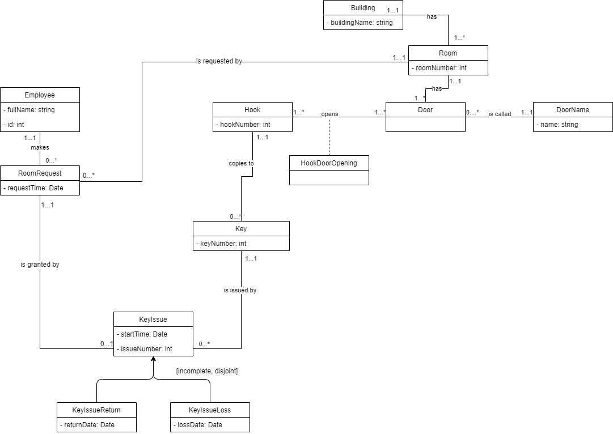
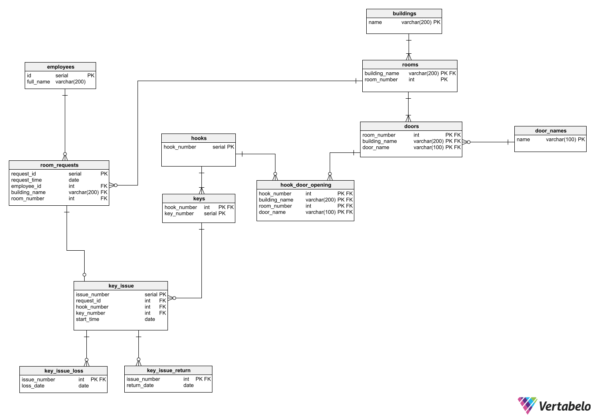

# Key-Hook

### Universal Modeling Language:

### Entity Relationship Diagram:

### Python Menu Options:
* Create a new Key.
* Request access to a given room by a given employee.
* Capture the issue of a key to an employee.
* Capture losing a key.
* Report out all the rooms that an employee can enter, given the keys that he/she already has.
* Delete a key.
* Delete an employee.
* Add a new door that can be opened by an existing hook.
* Update an access request to move it to a new employee.
* Report out all the employees who can get into a room.